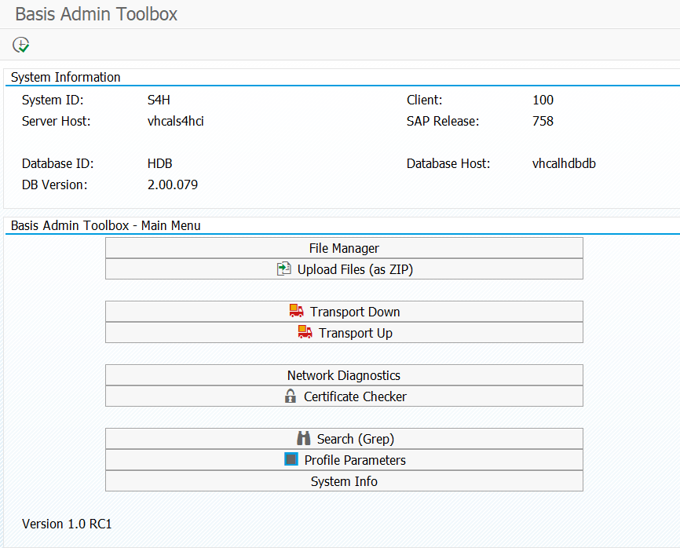
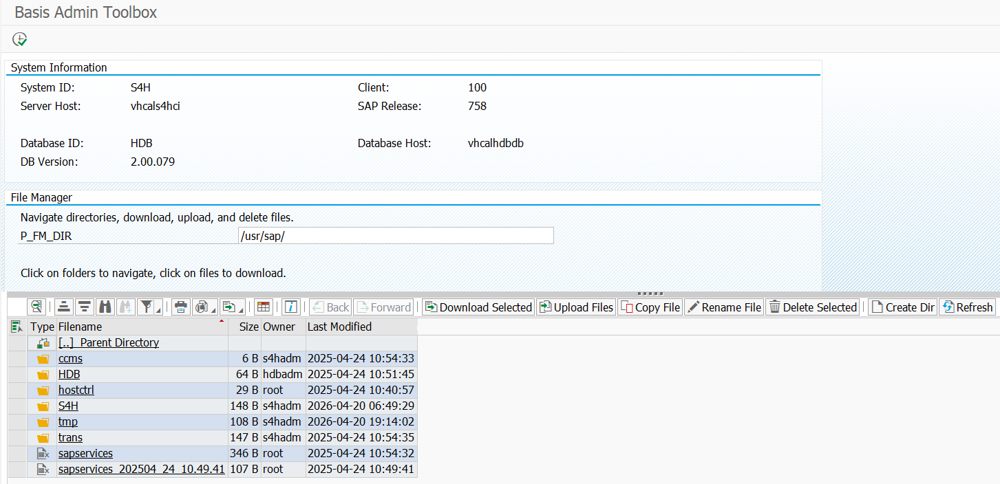
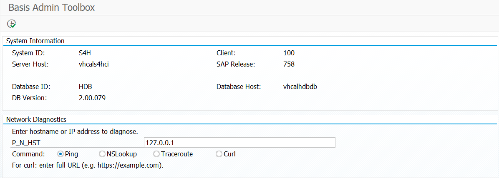
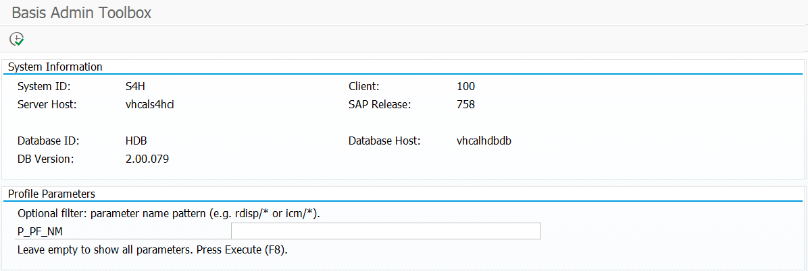
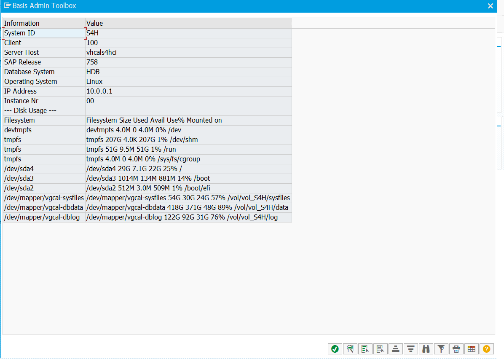

# SAP Basis Toolbox

A single-file ABAP report that gives SAP Basis administrators in **SAP Private Cloud** environments the operational tools they normally reach for via OS shell — without direct OS access.

> **Version:** 1.0 RC1

## Why

In SAP Private Cloud (RISE/HEC) environments, admins typically cannot SSH to the application server. Everyday tasks — inspecting directories, moving transports, checking certificate expiry, reading profile parameters, running a `ping` against a managed service — require workarounds through SM49, AL11, STRUST, RZ10, and friends. The Basis Toolbox consolidates the most common of these into a single report with a unified selection-screen UI, proper authorization gating, and an audit trail.

## Screenshots

**Main Menu** — system info header plus one-click entry to each module:



**File Manager** — ALV-based directory browser with toolbar actions (upload, download, copy, rename, delete, create dir, ZIP download):



**Network Diagnostics** — `ping` / `nslookup` / `traceroute` / `curl` against a hostname or URL:



**Profile Parameters** — filter-enabled browser over `DEFAULT.PFL` and the active instance profile:



**System Information** — system ID, client, release, DB host, kernel, IP, disk usage:



## Features

Nine modules, all reachable from one main menu:

| Module | Description |
|---|---|
| **File Manager** | Browse directories (ALV grid), upload, download, copy, rename, delete, create directories, download folders as ZIP, Back/Forward navigation |
| **Upload ZIP** | Extract a ZIP flat into a server directory |
| **Transport Download** | Pull `K*` / `R*` transport files from the server to the frontend |
| **Transport Upload** | Push up to 4 transports (Co-File + Data-File) from the frontend to the server |
| **Grep** | Recursive text search with filename filter, ALV result list with hotspot jump |
| **Network Diagnostics** | `ping`, `nslookup`, `traceroute`, `curl` against a hostname/URL |
| **Certificate Checker** | Scans `<DIR_INSTANCE>/sec/*.pse` and displays expiry status with traffic-light icons |
| **Profile Parameters** | Parses `DIR_PROFILE/DEFAULT.PFL` + instance profile; filter by pattern |
| **System Info** | `sy-*` fields, hostname/IP, disk usage (`df -h`), instance details |

## Architecture

- **Single-file ABAP report** (~3,500 lines, 40+ FORMs, one local event-handler class).
- **No custom screens** — everything is rendered on the standard selection screen via `MODIF ID` groups and a `gv_mode` dispatcher.
- **File Manager** uses `cl_gui_docking_container` + `cl_gui_alv_grid` with a local `lcl_event_receiver` for toolbar / user_command / hotspot events.
- **Other modules** use `cl_salv_table` pop-ups.
- **OS access** is limited to two paths:
  - `CALL 'SYSTEM'` — hard-wired commands only: `ping`, `nslookup`, `traceroute`, `curl`, `df -h`, `hostname -i`, `mkdir`, `rmdir`.
  - `OPEN DATASET` — for all file I/O.

## Security Model

Four defense-in-depth layers:

1. **Authorization Object `Z_BASTOOL`** with fields `ZBAS_MODL` (module) and `ZBAS_ACTN` (activity: `01 Display` / `02 Execute` / `99 Debug`). Checked at program start (startup gate), in PBO (button graying), and in PAI (module entry).
2. **Command whitelisting** — no generic shell. User input is rejected if it contains `;`, `|`, `&`, `` ` ``, `$`, `>`, `<`, `"`, `'`, `\`, or control characters.
3. **Audit Log** in transparent table `ZBAS_TOOL_LOG` via dynamic SQL (report remains activatable even when the table is missing). Severity `C` entries additionally go to **SM20** via `RSAU_WRITE_ALARM_ENTRY`. Audit is **PRD-only by default**; flip `c_audit_non_prd` to log on non-productive systems too.
4. **Production Restrictions** — `gv_is_prd` is set by `detect_production_system` (primary: custom config table `ZBAS_TOOL_CFG`, fallback: `T000-CCCATEGORY = 'P'`). On PRD, destructive operations are blocked (see role matrix).

### Developer Flags

Two compile-time constants near the top of the report let a developer override defaults without code-level refactoring:

```abap
CONSTANTS:
  c_audit_non_prd TYPE abap_bool VALUE abap_false,  " 'X' = write audit log on non-PRD too
  c_debug_mode    TYPE abap_bool VALUE abap_false.  " 'X' = bypass ALL auth/audit (dev only)
```

`c_debug_mode = 'X'` triggers the same bypass as the DEBUG role; a confirmation popup always warns at startup.

## Roles

Three self-contained PFCG roles. Each role **must** carry the standard SAP authorizations required to start the report and use its OS-level features — there is no separate starter role. The custom `Z_BASTOOL` object varies per role; the standard objects are identical across all three (only the values differ slightly for USER vs. ADMIN/DEBUG).

| Role | `Z_BASTOOL` | Summary |
|---|---|---|
| `Z_BASIS_TOOL_USER`  | `MODL ∈ {FM,TRD,TRU,NET,CRT,GRP,PRF,SYS}`, `ACTN=01` | Read/display only. **No** ZIP Upload, **no** Curl |
| `Z_BASIS_TOOL_ADMIN` | `MODL=*`, `ACTN ∈ {01,02}` | Full read + write. On PRD: no FM write except empty-dir delete, no ZIP Upload, no Transport Upload |
| `Z_BASIS_TOOL_DEBUG` | `MODL=*`, `ACTN ∈ {01,02,99}` | Emergency bypass — **no auditing**, PRD restrictions lifted. Use sparingly |

### Standard SAP Authorizations (PFCG values)

The following four standard objects must be maintained in every role. Values below are the minimum this report actually checks — adjust to your audit rules as needed.

#### `S_PROGRAM` — Program Execution

Needed to start the report via `SE38` / `SA38` / transaction code.

| Field | Value | Comment |
|---|---|---|
| `P_ACTION`  | `SUBMIT` | Interactive execution. Add `BTCSUBMIT` if scheduling in SM36 |
| `P_GROUP`   | *Auth group of `Z_BASIS_TOOLBOX`* (e.g. `ZBAS`) or `*` | Best practice: assign the report to a dedicated authorization group in its SE38 attributes, then name it here |

**Same values in all three roles.**

#### `S_C_FUNCT` — `CALL 'SYSTEM'` Kernel Calls

Required because the report uses `CALL 'SYSTEM'` for `ping`, `nslookup`, `traceroute`, `curl`, `df -h`, `hostname -i`, `mkdir`, `rmdir`. Without this object the OS-diagnostic modules fail.

| Field | Value | Comment |
|---|---|---|
| `CFUNCNAME` | `SYSTEM`           | The kernel function being called |
| `ACTVT`     | `16`               | Execute |
| `PROGRAM`   | `Z_BASIS_TOOLBOX`  | Name of the calling ABAP program |

**Same values in all three roles.**

#### `S_DATASET` — Application-Server File I/O

Required because the report uses `OPEN DATASET` / `DELETE DATASET`. The activities differ between USER and ADMIN.

| Field | USER | ADMIN / DEBUG | Comment |
|---|---|---|---|
| `ACTVT`     | `33` (Read) | `33`, `34`, `06`, `A6` | 33=Read, 34=Write, 06=Delete, A6=Read with filter |
| `PROGRAM`   | `Z_BASIS_TOOLBOX` | `Z_BASIS_TOOLBOX` | Calling program |
| `FILENAME`  | `*` or whitelist (e.g. `/usr/sap/*`, `/tmp/*`) | `*` or whitelist | Narrow this in audit-sensitive environments |

> **Audit tip:** restricting `FILENAME` to a directory whitelist (`/usr/sap/*`, `/usr/sap/trans/*`, `/tmp/*`) is the single biggest hardening step if your auditor pushes back on `FILENAME = *`.

#### `S_GUI` — SAP GUI Front-End Operations

Required for upload/download dialogs and clipboard interactions initiated by the report.

| Field | USER | ADMIN / DEBUG | Comment |
|---|---|---|---|
| `ACTVT` | `61` (Download) | `02`, `60`, `61` | 02=Change/Clipboard, 60=Upload, 61=Download |

USER needs only Download (Transport Download, file download, ZIP download). ADMIN/DEBUG additionally need Upload (Transport Upload, file upload, ZIP upload).

### Role Summary (PFCG copy-paste cheat sheet)

**`Z_BASIS_TOOL_USER`**
```
S_PROGRAM   P_ACTION = SUBMIT
            P_GROUP  = <auth group of Z_BASIS_TOOLBOX>
S_C_FUNCT   CFUNCNAME = SYSTEM
            ACTVT     = 16
            PROGRAM   = Z_BASIS_TOOLBOX
S_DATASET   ACTVT    = 33
            PROGRAM  = Z_BASIS_TOOLBOX
            FILENAME = *
S_GUI       ACTVT = 61
Z_BASTOOL   ZBAS_MODL = FM, TRD, TRU, NET, CRT, GRP, PRF, SYS
            ZBAS_ACTN = 01
```

**`Z_BASIS_TOOL_ADMIN`**
```
S_PROGRAM   P_ACTION = SUBMIT
            P_GROUP  = <auth group of Z_BASIS_TOOLBOX>
S_C_FUNCT   CFUNCNAME = SYSTEM
            ACTVT     = 16
            PROGRAM   = Z_BASIS_TOOLBOX
S_DATASET   ACTVT    = 33, 34, 06, A6
            PROGRAM  = Z_BASIS_TOOLBOX
            FILENAME = *
S_GUI       ACTVT = 02, 60, 61
Z_BASTOOL   ZBAS_MODL = *
            ZBAS_ACTN = 01, 02
```

**`Z_BASIS_TOOL_DEBUG`**
```
S_PROGRAM   P_ACTION = SUBMIT
            P_GROUP  = <auth group of Z_BASIS_TOOLBOX>
S_C_FUNCT   CFUNCNAME = SYSTEM
            ACTVT     = 16
            PROGRAM   = Z_BASIS_TOOLBOX
S_DATASET   ACTVT    = 33, 34, 06, A6
            PROGRAM  = Z_BASIS_TOOLBOX
            FILENAME = *
S_GUI       ACTVT = 02, 60, 61
Z_BASTOOL   ZBAS_MODL = *
            ZBAS_ACTN = 01, 02, 99
```

> After any change to a PFCG role: **Generate profile** and run **User comparison**.

### Activity Matrix

| Module | USER | ADMIN (non-PRD) | ADMIN (PRD) | DEBUG |
|---|---|---|---|---|
| FM Browse / Download | ✅ | ✅ | ✅ | ✅ |
| FM Upload / Copy / Rename / Create Dir | ❌ | ✅ | 🚫 blocked | ✅ |
| FM Delete File | ❌ | ✅ | 🚫 blocked | ✅ |
| FM Delete empty Dir | ❌ | ✅ | ✅ | ✅ |
| ZIP Upload | ❌ | ✅ | 🚫 blocked | ✅ |
| Transport Download | ✅ | ✅ | ✅ | ✅ |
| Transport Upload | ✅ | ✅ | 🚫 blocked | ✅ |
| Network (ping/nslookup/traceroute) | ✅ | ✅ | ✅ | ✅ |
| Network Curl | ❌ | ✅ | ✅ | ✅ |
| Grep / Certificates / Profile / System Info | ✅ | ✅ | ✅ | ✅ |

## DDIC Objects

All in package `Z_BASIS` / authorization class `ZZBASIS` (“Basis Custom Objects”).

| Object | Type | Notes |
|---|---|---|
| `ZBAS_DO_MODL` | Domain | `CHAR 3`, fixed values `FM`, `ZUP`, `TRD`, `TRU`, `GRP`, `NET`, `CRT`, `PRF`, `SYS`, `*` |
| `ZBAS_DO_ACTN` | Domain | `CHAR 2`, fixed values `01`, `02`, `99` |
| `ZBAS_DE_MODL`, `ZBAS_DE_ACTN` | Data Elements | Reference the domains above |
| `ZBAS_MODL`, `ZBAS_ACTN` | Authorization Fields (SU20) | Standard maintenance |
| `ZZBASIS` | Auth Object Class (SU21) | |
| `Z_BASTOOL` | Authorization Object (SU21) | Fields: `ZBAS_MODL` + `ZBAS_ACTN` |
| `ZBAS_TOOL_LOG` | Transparent table | Delivery class `A`, size `0`, no buffering. Key: `MANDT + LOG_ID` (GUID) |
| `ZBAS_TOOL_CFG` | Transparent table (optional) | `SYSID → SYS_TYPE`, read by `detect_production_system` |

At program start, a DDIC-object existence check runs and flags anything missing in a pop-up. The user can continue anyway (graceful degradation). The ZIP / audit table checks tolerate a missing `ZBAS_TOOL_LOG` at runtime via dynamic SQL, so the report activates even before the table exists.

## Installation

1. **Create DDIC objects** in package `Z_BASIS` — domains, data elements, authorization fields (SU20), authorization class `ZZBASIS` and object `Z_BASTOOL` (SU21), tables `ZBAS_TOOL_LOG` and optionally `ZBAS_TOOL_CFG`.
2. **Create the report** `Z_BASIS_TOOLBOX` (SE38, Type 1 Executable), paste [`SourceCode/Z_BASIS_TOOLBOX_v1.0.abap`](SourceCode/Z_BASIS_TOOLBOX_v1.0.abap), activate.
3. **Create PFCG roles** `Z_BASIS_TOOL_USER`, `Z_BASIS_TOOL_ADMIN`, and (if desired) `Z_BASIS_TOOL_DEBUG`. Generate profile. Run user comparison.
4. Optional: populate `ZBAS_TOOL_CFG` with `SYSID → PRD` mappings for environments where `T000-CCCATEGORY` is not set.
5. **Transport** to downstream systems.

## Usage

Run transaction `SE38` → `Z_BASIS_TOOLBOX` → `F8`. Pick a module from the main menu. Each module has its own selection-screen block with the parameters it needs. Press `F8` (or click the execute button) to run.

The File Manager opens a docking ALV grid with a toolbar — click a folder to navigate, click a file to download, use toolbar buttons to create / upload / delete / rename / copy / ZIP-download.

## Contributing

This is a single-file report maintained by one person for day-to-day Basis work. Pull requests and issues welcome, especially:

- Bug reports with SAP release / kernel version
- Additional read-only modules that fit the “no OS access” theme
- Hardening suggestions around auth or input validation

Please keep changes source-compatible with the single-file layout and bump `txt_ver` / the version in the header when you change security-relevant code.

## License

MIT — see [LICENSE](LICENSE).

## Author

Michael Rezmer
